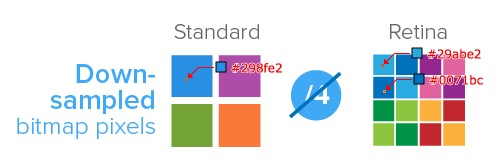

# px 和 dp

- **in** inches的缩写，英寸。就是屏幕的物理长度单位。一英寸等于2.54cm。比如Android手机常见的尺寸有5寸、5.5寸、6寸等，这里的长度都是指手机对角线的长度。`1in` = `2.54cm` = `96px`.
- **pt** “points” 的缩写，点。一个点等于1/72英寸，所以“点”也是个长度单位而已。 
- **px** “pixel” 的缩写，像素。是画面显示的基本单位，真实的像素并不是点或者方块（虽然有时这样显示），也没有实际固定长度，只是一个抽象的取样。设计中的像素和实际显示屏上的像素相对应。
  - 设备像素（device pixel），显示器屏幕实际上是由一个一个"点"组成的（每个"点"又包含3个单位，也称三元素组)，这些"点"就是设备像素。当降低屏幕分辨率时，一个点就需要更多的三元素组来组成。就是我们平时可以设置屏幕的分辨率。设备像素可以通过设置显示器分辨率来改变。devi
  - 参考像素（reference pixel），css参考像素它是一个visual angle，即一个约等于0.0213度的角
  - css 像素（css pixel），
- **dpi** (Dots per inch)每英寸的像素数，即像素密度

> For a CSS device, these dimensions（指in,pt,px等length单位） are either anchored by relating the physical units to their physical measurements, or by relating the pixel unit to the reference pixel. For print media and similar high-resolution devices, the anchor unit should be one of the standard physical units (inches, centimeters, etc). For lower-resolution devices, and devices with unusual viewing distances, it is recommended instead that the anchor unit be the pixel unit.For such devices it is recommended that the pixel unit refer to the whole number of device pixels that best approximates the reference pixel.

1inch 60px 

一些概念：

- **物理像素** 显示器上的最小显示单元
- **设备独立像素** 设备独立像素(也叫密度无关像素)，可以认为是计算机坐标系统中得一个点，这个点代表一个可以由程序使用的虚拟像素(比如: css像素)，然后由相关系统转换为物理像素。
- **设备像素比**，可以通过 `window.devicePixelRatio` 获取当前设备的 dpr，我测试了下，在我的 mac 上是 2，iphone8plus 是 3，我的 dell 外接显示器是 1

    ```js
    设备像素比(dpr) = 物理像素 / 设备独立像素 // 在某一方向上，x方向或者y方向
    ```

比如，我们在开发的时候，chrome 开发者工具切换成 device 模式，比如设置为 iphone8plus 模式，分辨率为 414 x 736(css 像素)，即屏幕最多能显示宽度为 414px 的 div，我本地测了我的 iphone8plus 的 devicePixelRatio 为 3，则可以计算出我的 ip8 的实际物理分辨率为 (414 x 736)*3 = 1242 x 2208。
修改显示器的分辨率，他的 dpr 是不变的，可视区域变小


如图，可以看到，在 retina 屏幕上，一个 css 像素对应 4 个物理像素，普通屏幕上，1 个 css 像素对应 1 个物理像素



理论上，1个位图像素对应于1个物理像素，图片才能得到完美清晰的展示。
对于dpr=2的retina屏幕而言，1个位图像素对应于4个物理像素，由于单个位图像素不可以再进一步分割，所以只能就近取色，从而导致图片模糊(注意上述的几个颜色值)。
对于图片高清问题，比较好的方案就是两倍图片(@2x)，可以根据 dpr 来决定几倍图片。


2 倍图片在普通屏幕上显示的结果。所以它的取色也只能通过一定的算法(显示结果就是一张只有原图像素总数四分之一，我们称这个过程叫做 downsampling)，肉眼看上去虽然图片不会模糊，但是会觉得图片缺少一些锐利度，或者是有点色差(但还是可以接受的)。


demo中，100×100的图片，分别放在100×100，50×50，25×25的img容器中，在retina屏幕下的显示效果。

条形图，通过放大镜其实可以看出边界像素点取值的不同：

图1，就近取色，色值介于红白之间，偏淡，图片看上去会模糊(可以理解为图片拉伸)。
图2，没有就近取色，色值要么是红，要么是白，图片看上去很清晰。
图3，就近取色，色值介于红白之间，偏重，图片看上去有色差，缺少锐利度(可以理解为图片挤压)。


## rem

浏览器默认的 html 大小是 16px

```css
/** 设置 1rem = 10px*/ 
.body{font-size:62.5%;}
```

## 参考

[jawil/blog](https://github.com/jawil/blog/issues/21)
[移动端高清、多屏适配方案](https://blog.csdn.net/qq_34629352/article/details/104025171)