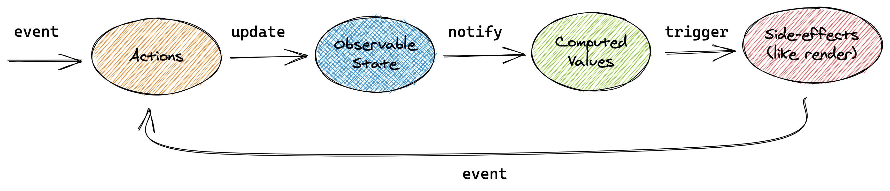

# mobx




- `makeObservable` 通常用在 class 的 constructor 上，将 class 变成 observable
- **observable** 标记一个属性或者对象，表示该属性或者对象是 observable 的
- **computed** 表示计算属性
- **action** 通常用在函数上，用来改变 state，通常不允许在 action 之外来改变 state
  - `flow` 包装 async / await 使用更简单，使用 generator function

    ```js
    // * instead async
    fetchProjects = flow(function* (this: Store) {
        // yield instead await
        const projects = yield fetchGithubProjectsSomehow()
    ```

- **Computed** 从其他 observables 里面来获取值，值延迟计算，值会被缓存，并且只有在他依赖的 observable 改变时才会重新计算

```js
import { makeObservable, observable, computed, action, makeAutoObservable } from "mobx"

class Doubler {
    value

    constructor(value) {
        makeObservable(this, {
            value: observable,
            double: computed,
            increment: action
        })
        this.value = value
    }

    get double() {
        return this.value * 2
    }

    increment() {
        this.value++
    }
}

function createDoubler(value) {
    return makeAutoObservable({
        value, // observable
        get double() { // computed属性
            return this.value * 2
        },
        increment() { // autoAction
            this.value++
        }
    })
}
```

基础概念：

```js
import { makeObservable, observable, computed } from "mobx"

class TodoList {
    todos = []
    get unfinishedTodoCount() {
        return this.todos.filter(todo => !todo.finished).length
    }
    constructor(todos) {
        makeObservable(this, { // 将当前对象变成被观察者
            todos: observable, // 观察属性
            unfinishedTodoCount: computed // 计算属性
        })
        this.todos = todos;
    }
}
```

## [react integration](https://mobx.js.org/react-integration.html)

## mobx-react-lite

This is a lighter version of mobx-react which **supports React functional components only** and as such makes the library slightly faster and smaller (only 1.5kB gzipped).

## 参考

[mobx-cn](https://cn.mobx.js.org/)

[mobx-react-devtools](https://github.com/mobxjs/mobx-react-devtools)

[mobx-react-lite](https://github.com/mobxjs/mobx-react-lite)