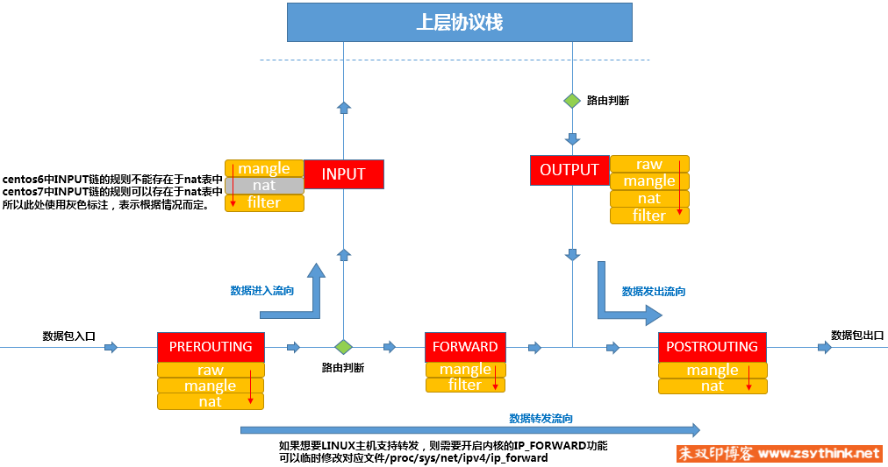

# linux-iptables

## 基本概念

- PREROUTING
- INPUT
- FORWARD
- OUTPUT
- POSTROUTING

报文的流向

- 到本机 PREROUTING -> INPUT
- 本机转发 PREROUTING -> FORWARD -> POSTROUTING
- 本机进程发出 OUTPUT -> POSTROUTING

### 表

相同规则的集合叫做 **表**

- filter 表，负责过滤
- nat 表，网络地址转换
- mangle 表，拆解报文，修改
- raw 表，关闭 nat 表上启动的连接追踪机制

### 规则

根据指定的匹配条件来尝试匹配每个流经此处的报文，匹配成功，则由规则指定的动作来处理

> 匹配条件

- 基本匹配条件
- 拓展匹配条件

> 处理动作：

- ACCEPT：允许数据包通过。
- DROP：直接丢弃数据包，不给任何回应信息，这时候客户端会感觉自己的请求泥牛入海了，过了超时时间才会有反应。
- REJECT：拒绝数据包通过，必要时会给数据发送端一个响应的信息，客户端刚请求就会收到拒绝的信息。
- SNAT：源地址转换，解决内网用户用同一个公网地址上网的问题。
- MASQUERADE：是 SNAT 的一种特殊形式，适用于动态的、临时会变的 ip 上。
- DNAT：目标地址转换。
- REDIRECT：在本机做端口映射。
- LOG：在/var/log/messages 文件中记录日志信息，然后将数据包传递给下一条规则，也就是说除了记录以外不对数据包做任何其他操作，仍然让下一条规则去匹配。
- RETURN:防停止执行当前链的后续 rules，并返回到调用链中



图中可以看到如下

- 有哪些类型的表，**黄色的表示表**
- 有哪些类型的链，**红色的表示链**
- 链的规则可以存放在哪些表中
- 表的规则可以应用到哪些链中
- 链中表的执行优先级

## 命令

```bash
# -t指定要操作的表 -L链名 -v 可以查出更详细的信息 -n直接显示ip地址l
# 省略 t 默认就是 filter 表
# --line显示行号 规则从上到下执行，前面的可能会影响后面的
iptables -t filter -nvL --line
# 清空INPUT链上的规则
iptables -F INPUT

# 添加规则
# -t表名 -I插入到INPUT链中 -s匹配条件原地址 -j动作 -A在链尾添加规则
iptables -t filter -I INPUT -s 192.168.1.100 -j DROP
# 修改规则
# 修改INPUT链的第一条规则，必须指明原规则中的原匹配条件
iptables -t filter -R INPUT 1 -s 192.168.1.146 -j REJECT
# 删除规则
# 通过 --line 查看第几条规则
iptables -t filter -D INPUT 3
# 删除源地址为192.168.1.146，动作为 ACCEPT的规则
iptables -D INPUT -s 192.168.1.146 -j ACCEPT
# 保存规则
service iptables save

## centos7需要安装 iptables-service
yum install -y iptables-services
# 停止 firewalld
systemctl stop firewalld
# 禁止自动启动
systemctl disable firewalld
# 启动 iptables
systemctl start iptables
# 设置自动启动
systemctl enable iptables


## 匹配规则
# -s指定源地址 -d指定目标地址 -p 指定协议
# -i匹配报文通过哪个网卡流入本机
# -o匹配报文通过哪个网卡流出
# --dport目标端口 --sport源端口

# 拒绝192.168.1.146的22端口
iptables -t filter -I INPUT -s 192.168.1.146 -p tcp --dport 22 -j REJECT
```

> -v 选项提供的信息

- pkts 对应规则匹配到的报文个数
- bytes 对应规则匹配到的包的大小总和
- target 规则对应的动作

> Chain INPUT (policy ACCEPT 16888 packets, 2630K bytes)

- INPUT 链默认的动作是 ACCEPT，接受通过 INPUT 关卡的所有请求

## 参考

[iptables 详解](http://www.zsythink.net/archives/1199)

iptables -A INPUT -p tcp --dport 58000 -j ACCEPT
iptables -A OUTPUT -p tcp --sport 58000 -j ACCEPT

firewall-cmd --zone=public --add-port=7009/tcp --permanent
